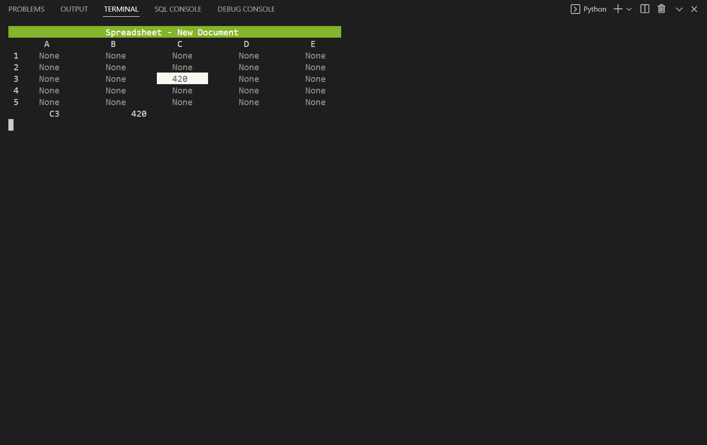
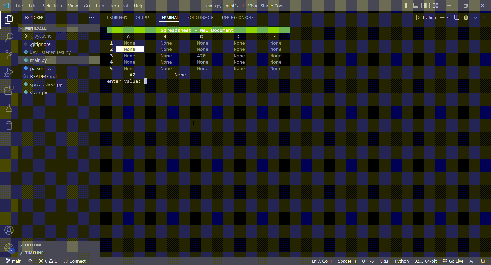

# Command-Line-Mini-SpreadSheet
Simple command line based spreadsheet built with Python for Windows. 

## I try to make it pretty and light
This is built around **ANSI Color Codes** for output. **A terminal that supports this is needed**. 
There is no other dependencies needed. 
You have to be on a Windows machine and have Python >=3.8

## Motivation
I was studying **compiler design** and how stacks are used to expression. 
So I thought a speadsheet program would be a neat little project to build my own expression evaluator. 
Everything is implemented from scratch: the parser, postfix covertor to the spreadsheet core.

## How to use it   
I made the controls as intuitive as possible.

- **NAVIGATION**
   Use arrow keys or AWSD or 4862 on the keypad to navigate

- **VALUE INPUT**
 To enter a value in a cell, go to the desired cell, press Enter and then finally input your value

- **CALCULATION/FORMULA**
 If you want to perform a calculation press enter on the desire cell, prepend yout calculation with an '='. For example =6+9 will get you 15 in the cell.

- **USING CELL VALUES IN CALCULATION**
 You can also use cell values in your calculations. If you had the value 5 in cell A1 and 
value 10 in cell B2. Performing =A1+B2 in cell C3 will give you value 15 in the latter.

